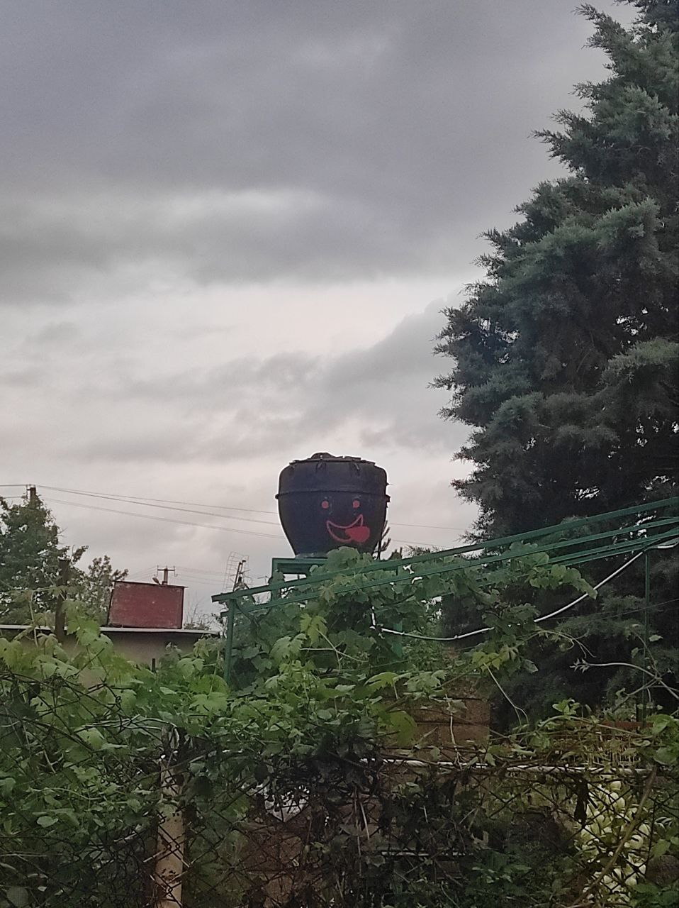
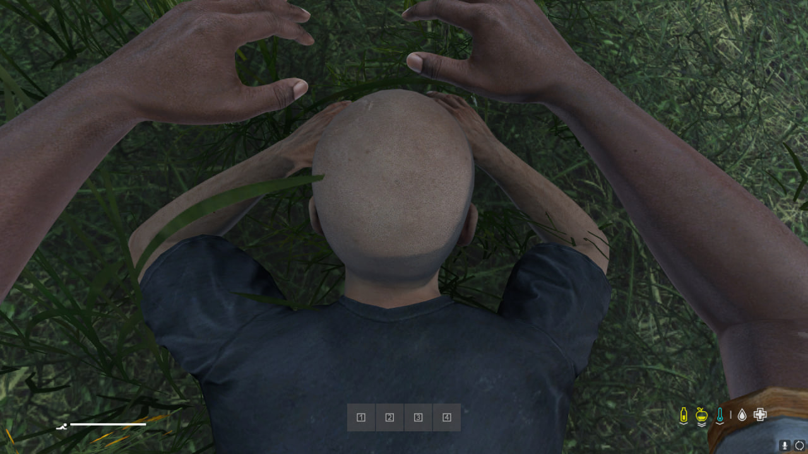

## Характеристики зображень до змін:

|            | Фотографія | Скриншот | Графічне зображення |
|------------|----------|---------------------|------------|
| **Розмір** | 958x1280 | 1280x720 | 281x179 |
| **Формат** | JPG | JPG | JPG |
| **Вага** | 214.5 кб | 148 кб | 8.8 кб |

---

## Характеристики зображень с форматом PNG (lossless)

|            | Фотографія | Скриншот | Графічне зображення |
|------------|----------|---------------------|------------|
| **Розмір** | 958x1280 | 1280x720 | 281x179 |
| **Формат** | PNG | PNG | PNG |
| **Вага** | 1.5 мб | 542 кб | 80.3 кб |

---

## Характеристики зображень с форматом WebP (lossless)

|            | Фотографія | Скриншот | Графічне зображення |
|------------|----------|---------------------|------------|
| **Розмір** | 958x1280 | 1280x720 | 281x179 |
| **Формат** | WebP | WebP | WebP |
| **Вага** | 610 кб | 542 кб | 27.2 кб |

---

## Характеристики зображень с форматом WebP (lossy)

|            | Фотографія | Скриншот | Графічне зображення |
|------------|----------|---------------------|------------|
| **Розмір** | 958x1280 | 1280x720 | 281x179 |
| **Формат** | WebP | WebP | WebP |
| **Вага (100%)** | 408.6 кб | 221.8 кб | 19.6 кб |
| **Вага (75%)** | 122.9 кб | 43.8 кб | 7.1 кб |
| **Вага (50%)** | 91.3 кб | 29.5 кб | 5.5 кб |

---

## Характеристики зображень с форматом MozJPEG

|            | Фотографія | Скриншот | Графічне зображення |
|------------|----------|---------------------|------------|
| **Розмір** | 958x1280 | 1280x720 | 281x179 |
| **Формат** | JPG | JPG | JPG |
| **Вага (100%)** | 425.6 кб | 274.8 кб | 30.4 кб |
| **Вага (75%)** | 145.2 кб | 60.2 кб | 8.2 кб |
| **Вага (50%)** | 79.2 кб | 36.6 кб | 5.9 кб |

---

## Характеристики зображень с форматом AVIF

|            | Фотографія | Скриншот | Графічне зображення |
|------------|----------|---------------------|------------|
| **Розмір** | 958x1280 | 1280x720 | 281x179 |
| **Формат** | AVIF | AVIF | AVIF |
| **Вага (100%)** | 313 кб | 178 кб | 18.7 кб |
| **Вага (75%)** | 156 кб | 66 кб | 8.99 кб |
| **Вага (50%)** | 92.4 кб | 24.7 кб | 6.02 кб |

---

## Характеристики зображень після зміни розміру відповідно до іншого застосунку

|            | Фотографія | Скриншот | Графічне зображення |
|------------|----------|---------------------|------------|
| **Розмір** | 600x802 | 2560x1440 | 1200x764 |
| **Формат** | PNG | PNG | PNG |
| **Вага (100%)** | 679.7 кб | 4.07 мб | 965.3 кб |

## Таблиця порівняння розмірів зображень

|                 | **Оригінал** | **PNG (lossless)** | **WebP (lossless)** | **MozJPEG** | **WebP (lossy)** | **AVIF** | **Оптимізація** |
|---------------|-------------|-----------------|-----------------|----------|-------------|------|--------------|
| **Фотографія** | 214.5 кб    | 1.5 мб          | 610 кб          | 425.6 кб | 408.6 кб    | 313 кб | 679.7 кб     |
| **75%**       | -           | -               | -               | 145.2 кб | 122.9 кб    | 156 кб | -            |
| **50%**       | -           | -               | -               | 79.2 кб  | 91.3 кб     | 92.4 кб | -            |
| **Скриншот**  | 148 кб      | 542 кб          | 542 кб          | 274.8 кб | 221.8 кб    | 178 кб | 4.7 мб       |
| **75%**       | -           | -               | -               | 60.2 кб  | 43.8 кб     | 66 кб  | -            |
| **50%**       | -           | -               | -               | 36.6 кб  | 29.5 кб     | 24.7 кб | -            |
| **Графічне зображення** | 8.8 кб | 80.3 кб | 27.2 кб | 30.4 кб | 19.6 кб | 18.7 кб | 965.3 кб |
| **75%**       | -           | -               | -               | 8.2 кб   | 7.1 кб      | 8.99 кб | -            |
| **50%**       | -           | -               | -               | 5.9 кб   | 5.5 кб      | 6.02 кб | -            |

## Вхідне зображення для мобільних пристроїв:

## Оптимізоване:
.png)

## Вхідне зображення для вебу:

## Оптимізоване:
.png)

## Вхідне зображення для Retina-дисплеїв:

## Оптимізоване:
.png)

## Висновок:
## 1️⃣ Який формат найкраще підходить для якого типу зображень?
**PNG (lossless)** – найкращий для зображень з прозорістю, скріншотів та графіки з текстом. Висока якість, але великий розмір.  
**WebP (lossless)** – підходить для веб-графіки та іконок, забезпечує кращу компресію, ніж PNG.  
**WebP (lossy)** – оптимальний для фотографій на вебсайтах: гарний баланс між якістю та розміром.  
**MozJPEG** – ідеальний для збереження якісних фотографій з меншою вагою, ніж стандартний JPEG.  
**AVIF** – найкращий для вебу, забезпечує найкраще стиснення без значної втрати якості, ідеальний для фото та графіки.  

## 2️⃣ Як зміна розміру впливає на оптимізацію?
- Зменшення розміру зображення (менше пікселів) суттєво зменшує його вагу, що покращує швидкість завантаження.  
- Якщо змінювати розмір без оптимізації формату, зображення може втрачати чіткість.  
- Розширення маленького зображення до більшого формату (upsampling) **не рекомендується**, бо це призводить до розмитості.  

## 3️⃣ Як правильно адаптувати зображення для Retina-дисплеїв?
- Використовуйте зображення з **подвійною роздільною здатністю (2x або 3x)**. Наприклад, якщо потрібно показати картинку 500×500 px, збережіть її у 1000×1000 px або 1500×1500 px.  
- Використовуйте **WebP або AVIF** для швидкого завантаження без втрати якості.  
- В CSS можна застосувати `srcset` для адаптивних зображень:  